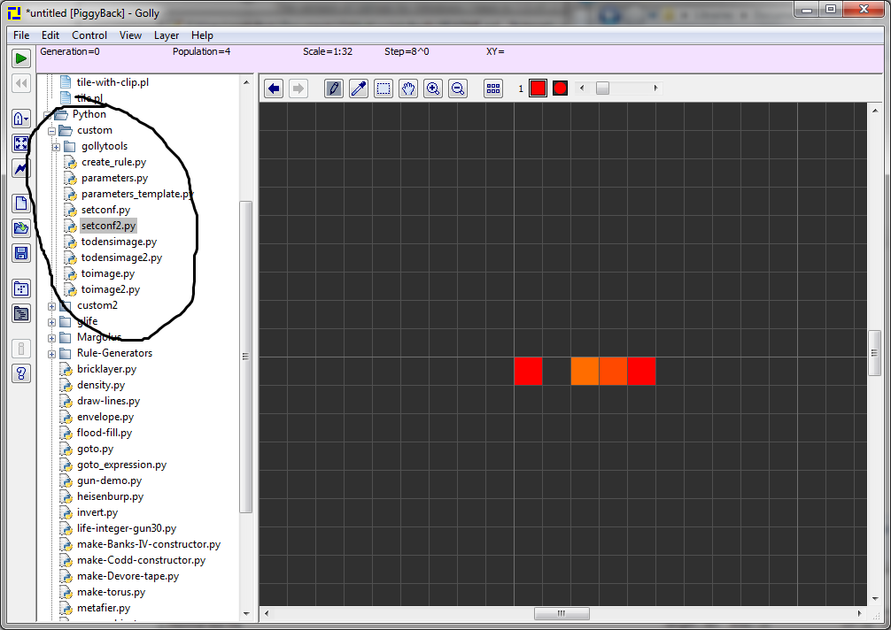

Scripts for Golly
=================

### Description ###

Some scripts for playing around with golly.

### Installation ###

Simply place the "custom" folder inside the "Scripts/Python" folder of your golly
installation. For instance, on my windows machine, golly is located at:

C:\Users\math4tots\Documents\tools\golly-2.5-win

So the path to my custom folder should be:

C:\Users\math4tots\Documents\tools\golly-2.5-win\Scripts\Python\custom

### Usage ###

To use these scripts, simply start golly and double click on the script that 
you want to run from the scripts list:

To modify the behavior, simply modify the parameters in the file parameters.py

Simply edit the values here:

